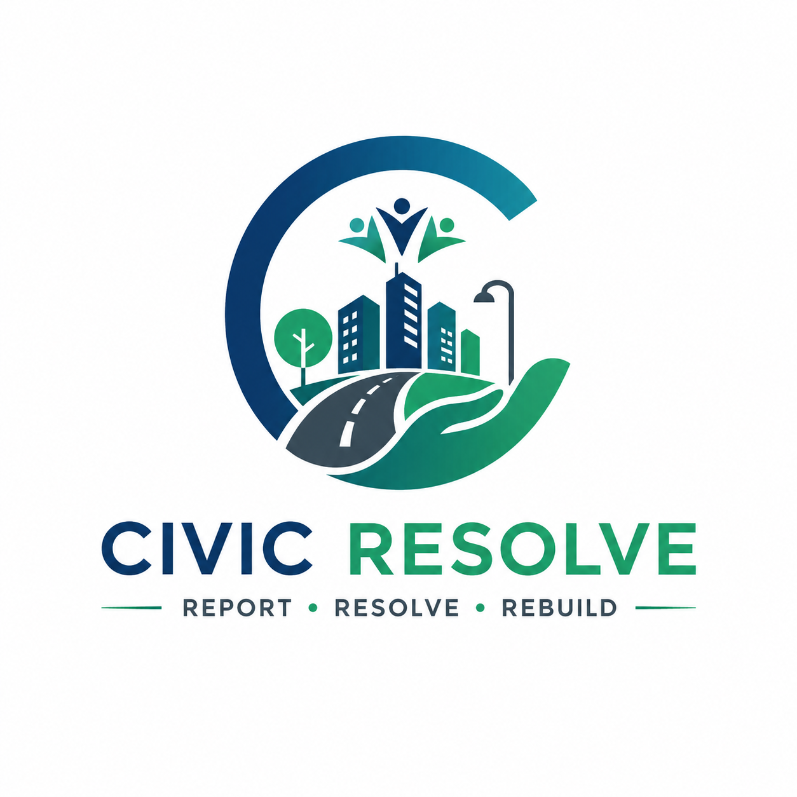

<p align="center">
  
</p>

<h1 align="center">🏛️ CivicResolve — AI-Powered Smart Civic Issue Resolution Platform</h1>

<p align="center">
  <strong>Bridging the gap between citizens and local government through AI-driven civic complaint management.</strong>
</p>

<p align="center">
  
  
  
  
  
  
  
  
  
</p>

---

## 📖 Overview

**CivicResolve** is a full-stack, production-grade platform that allows citizens to report civic issues (potholes, garbage, streetlight failures, etc.) using photo evidence and GPS location. The platform leverages **Google Gemini AI** to automatically analyze uploaded images, categorize the issue, and determine priority based on both visual severity and proximity to sensitive locations (schools, hospitals, etc.).

The system supports a **multi-role hierarchy** — Citizens, Field Officers, Department Heads, Municipal Commissioners, and Super Admins — with automated assignment, SLA tracking, escalation workflows, and a gamified reward system.

---

## ✨ Key Features

### 🤖 AI-Powered Analysis
- **Image Classification**: Gemini 2.5 Flash analyzes uploaded photos to identify the type of civic issue
- **Location-Aware Priority Scoring**: Combines visual severity (1-5) with location sensitivity (proximity to schools, hospitals via OpenStreetMap Overpass API) to compute priority (LOW → CRITICAL)
- **Justification**: Human-readable AI explanation for the assigned priority

### 👥 Multi-Role Dashboards
| Role | Capabilities |
|------|-------------|
| **Citizen** | Report issues, track status, upvote, verify resolutions, earn points |
| **Field Officer** | View assigned complaints, update status with resolution photos + GPS verification |
| **Department Head** | Monitor department-level complaints, manage escalations |
| **Commissioner** | City-wide oversight, analytics, system-level escalation |
| **Super Admin** | Full platform administration, user management, data seeding |

### 🗺️ Geospatial Features
- GPS auto-capture on complaint submission
- PostGIS-powered nearby issue detection
- Interactive maps with complaint clustering
- Officer assignment by geographic proximity

### 🏆 Gamification & Rewards
- Citizen reward points for reporting, verifying, and community engagement
- Leaderboard system with ranking tiers
- Top contributor recognition

### 🔔 Real-Time Notifications
- Server-Sent Events (SSE) for live updates
- Email notifications via SMTP (OTP, status changes)
- In-app notification center

### 📊 SLA & Escalation Engine
- Automatic SLA deadline calculation based on priority
- Auto-escalation when SLA breaches
- Manual escalation support
- Reopening support with tracking

---

## 🏗️ Architecture

```
┌──────────────────────────────────────────────────────┐
│                    FRONTEND (React + Vite)            │
│  TypeScript │ TailwindCSS │ Material Symbols          │
│  React Router │ Axios │ Firebase Auth                 │
└─────────────────────────┬────────────────────────────┘
                          │ REST API (JSON)
┌─────────────────────────▼────────────────────────────┐
│               BACKEND (Spring Boot 3.x)              │
│  ┌──────────┐ ┌───────────┐ ┌────────────────────┐   │
│  │ Auth     │ │ Complaint │ │ AI Inference        │   │
│  │ (JWT +   │ │ Management│ │ (Gemini 2.5 Flash)  │   │
│  │ Firebase)│ │ + CRUD    │ │ + Overpass API      │   │
│  └──────────┘ └───────────┘ └────────────────────┘   │
│  ┌──────────┐ ┌───────────┐ ┌────────────────────┐   │
│  │ Officer  │ │ SLA +     │ │ Reward +            │   │
│  │ Assign   │ │ Escalation│ │ Leaderboard         │   │
│  └──────────┘ └───────────┘ └────────────────────┘   │
└───────┬───────────────┬──────────────────────────────┘
        │               │
   ┌────▼────┐    ┌─────▼─────┐
   │PostgreSQL│    │   Redis   │
   │ + PostGIS│    │  (Cache)  │
   └──────────┘    └───────────┘
```

---

## 📁 Project Structure

```
CivicResolve/
├── backend/                          # Spring Boot backend
│   ├── src/main/java/com/civic/platform/
│   │   ├── api/
│   │   │   ├── controllers/          # REST controllers
│   │   │   └── dto/                  # Request/Response DTOs
│   │   ├── config/                   # App config & data seeder
│   │   ├── domain/
│   │   │   ├── entities/             # JPA entities
│   │   │   ├── enums/                # Category, Role, Status enums
│   │   │   ├── repositories/         # Spring Data JPA repos
│   │   │   └── services/             # Business logic & AI inference
│   │   └── security/                 # JWT, Firebase, Spring Security
│   ├── src/main/resources/
│   │   └── application.yml           # Externalized config
│   ├── Dockerfile
│   └── build.gradle
├── frontend/                         # React + Vite frontend
│   ├── src/
│   │   ├── api/                      # API client modules
│   │   ├── components/               # Shared layout components
│   │   ├── context/                  # Auth context provider
│   │   ├── lib/                      # Firebase initialization
│   │   ├── pages/                    # Route page components
│   │   └── services/                 # Legacy API service
│   ├── .env                          # Firebase config (gitignored)
│   └── vite.config.ts
├── db/                               # PostgreSQL init scripts
│   └── init.sql                      # Schema + PostGIS extensions
├── docs/                             # Project documentation
│   └── phase-1/                      # SRS, requirements, use cases
├── k8s/                              # Kubernetes deployment manifests
├── docker-compose.yml                # Full stack orchestration
├── .env.example                      # Environment template
└── README.md
```

---

## 🚀 Getting Started

### Prerequisites

- **Docker** & **Docker Compose** (v2+)
- **Git**
- (Optional) **Node.js 20+** and **Java 17+** for local development without Docker

### 1. Clone the Repository

```bash
git clone https://github.com/Varun879/CivicResolve.git
cd CivicResolve
```

### 2. Configure Environment

```bash
cp .env.example .env
```

Edit `.env` and fill in your actual values:

| Variable | Description |
|----------|-------------|
| `POSTGRES_PASSWORD` | PostgreSQL database password |
| `JWT_SECRET` | 64-char hex string for JWT signing |
| `SMTP_USER` | Gmail address for sending emails |
| `SMTP_PASS` | Gmail App Password ([generate here](https://myaccount.google.com/apppasswords)) |
| `GEMINI_API_KEY` | Google Gemini API key ([get one](https://aistudio.google.com/apikey)) |

### 3. Configure Firebase (Frontend)

Create `frontend/.env` with your Firebase project config:

```env
VITE_FIREBASE_API_KEY=<your_firebase_api_key>
VITE_FIREBASE_AUTH_DOMAIN=<your_project>.firebaseapp.com
VITE_FIREBASE_PROJECT_ID=<your_project_id>
VITE_FIREBASE_STORAGE_BUCKET=<your_project>.firebasestorage.app
VITE_FIREBASE_MESSAGING_SENDER_ID=<your_sender_id>
VITE_FIREBASE_APP_ID=<your_app_id>
VITE_FIREBASE_MEASUREMENT_ID=<your_measurement_id>
```

### 4. Launch the Platform

```bash
docker-compose up --build
```

| Service | URL |
|---------|-----|
| **Frontend** | http://localhost:5173 |
| **Backend API** | http://localhost:8080 |
| **PostgreSQL** | localhost:5432 |
| **Redis** | localhost:6379 |

### 5. Default Users (Seeded Automatically)

| Email | Password | Role |
|-------|----------|------|
| `citizen@test.com` | `password` | Citizen |
| `officer@test.com` | `password` | Field Officer |
| `depthead@test.com` | `password` | Department Head |
| `commissioner@test.com` | `password` | Commissioner |

---

## 🛡️ Security

- **Authentication**: JWT + Firebase Google OAuth2 with BCrypt (cost 12) password hashing
- **Authorization**: Spring Security method-level RBAC (`@PreAuthorize`)
- **Secrets Management**: All credentials externalized via environment variables — never hardcoded
- **CORS**: Configured for specific origins
- **Input Validation**: Jakarta Bean Validation on all DTOs
- **SQL Injection**: Prevented via JPA parameterized queries
- **XSS**: React's default escaping + no `dangerouslySetInnerHTML`

---

## 🔧 Tech Stack

| Layer | Technology |
|-------|-----------|
| **Frontend** | React 18, TypeScript, Vite, TailwindCSS, Axios |
| **Backend** | Java 17, Spring Boot 3.x, Spring Security, Spring Data JPA |
| **Database** | PostgreSQL 15 + PostGIS 3.3 |
| **Cache** | Redis 7 |
| **AI** | Google Gemini 2.5 Flash (Vision + JSON mode) |
| **Auth** | JWT + Firebase Auth (Google OAuth2) |
| **Geolocation** | OpenStreetMap Overpass API |
| **Email** | Spring Mail (SMTP) |
| **Containerization** | Docker + Docker Compose |
| **Orchestration** | Kubernetes (manifests included) |

---

## 📡 API Endpoints

### Authentication
| Method | Endpoint | Description |
|--------|----------|-------------|
| POST | `/api/v1/auth/register` | Register new user |
| POST | `/api/v1/auth/login` | Login (email + password) |
| POST | `/api/v1/auth/google` | Google OAuth2 login |
| POST | `/api/v1/auth/send-otp` | Send OTP via email |

### Complaints
| Method | Endpoint | Description |
|--------|----------|-------------|
| GET | `/api/v1/complaints` | List all complaints |
| POST | `/api/v1/complaints` | Create complaint (with AI analysis) |
| GET | `/api/v1/complaints/{id}` | Get complaint details |
| GET | `/api/v1/complaints/nearby` | Find nearby complaints (PostGIS) |
| PATCH | `/api/v1/complaints/{id}/status` | Update complaint status |
| POST | `/api/v1/complaints/{id}/upvote` | Upvote a complaint |
| POST | `/api/v1/complaints/{id}/comments` | Add comment |
| POST | `/api/v1/complaints/{id}/escalate` | Manual escalation |

### AI Analysis
| Method | Endpoint | Description |
|--------|----------|-------------|
| POST | `/api/v1/ai/analyze` | Analyze image for category + priority |

### Officer
| Method | Endpoint | Description |
|--------|----------|-------------|
| GET | `/api/v1/officer/assignments` | Get officer's assignments |
| PATCH | `/api/v1/officer/complaints/{id}/status` | Update complaint with resolution |

### Rewards
| Method | Endpoint | Description |
|--------|----------|-------------|
| GET | `/api/v1/rewards/leaderboard` | Get leaderboard |
| GET | `/api/v1/rewards/my-points` | Get current user's points |

---

## 🤝 Contributing

1. Fork the repository
2. Create a feature branch (`git checkout -b feature/amazing-feature`)
3. Commit your changes (`git commit -m 'Add amazing feature'`)
4. Push to the branch (`git push origin feature/amazing-feature`)
5. Open a Pull Request

---

## 📄 License

This project is for educational and demonstration purposes.

---

<p align="center">
  Built with ❤️ for smarter cities
</p>
