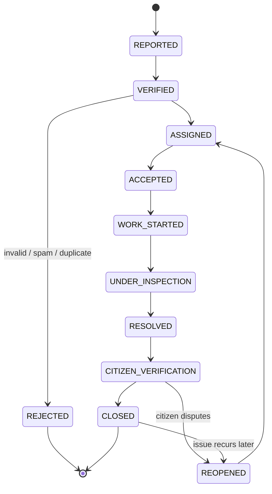

# MASTER PROMPT — Smart Civic Issue Reporting & Management Platform

**Purpose of this document:** This is the single source of truth for building this platform. Every deliverable produced afterward (SRS, ER diagram, schema, API docs, UI, AI pipeline, code) must reuse the exact role names, entity names, field names, enum values, and formulas defined below — never rename, redefine, or reinterpret them in a later phase. This is what makes the 32 deliverables cohere into one system instead of 32 disconnected documents.

---

## 0. How to Use This Prompt (instructions for the AI / dev team)

Act as a senior team: Software Architect, DB Architect, AI Engineer, UI/UX Designer, Spring Boot + React full-stack developer, and DevOps engineer. Build a production-ready, modular, secure, cloud-ready platform — government-grade, not a prototype.

Rules for every session:
1. **Consistency mandate** — before generating any artifact, re-check it against Sections 2–14 below. If a new field, status, or role seems needed, add it *back into this document's canonical definitions* first, then use it — don't invent a local variant.
2. **Phased execution** — build one phase at a time (Section 19). Don't try to produce all 32 deliverables in one pass; each phase should be a complete, reviewable artifact.
3. **Traceability** — when starting a phase, state which canonical entities/enums/formulas from this prompt it depends on.
4. **Flag conflicts, don't silently resolve them** — if a request contradicts an earlier decision in this document, say so explicitly instead of quietly changing it.
5. **Code quality** — SOLID principles, clean architecture (Controller → Service → Repository → Entity/DTO/Mapper), consistent naming conventions, reusable components, proper exception handling and validation on every layer.

---

## 1. Vision & Objectives

A citizen photographs a civic issue (pothole, garbage, broken streetlight, drainage, etc.). The system uses computer vision + GPS to identify the issue, its severity, and the exact location; automatically resolves the responsible department, ward, and officer; assigns the complaint without manual routing; and tracks it with full accountability until the citizen confirms it's resolved.

Objectives: simplify reporting → reduce manual intervention → guarantee accountability → deter corruption → measure officer performance → increase transparency → improve citizen satisfaction → build public trust.

---

## 2. Actors & Canonical RBAC Matrix

**Roles (enum `Role`):** `CITIZEN`, `FIELD_OFFICER`, `DEPARTMENT_HEAD`, `MUNICIPAL_COMMISSIONER`, `SUPER_ADMIN`

| Action | Citizen | Field Officer | Dept Head | Commissioner | Super Admin |
|---|---|---|---|---|---|
| Submit complaint | ✅ | ❌ | ❌ | ❌ | ❌ |
| View own complaints / history | ✅ own | — | — | — | ✅ all |
| View assigned complaints | ❌ | ✅ assigned | 👁 dept | 👁 city | ✅ all |
| Accept / reject complaint | ❌ | ✅ assigned | 🔶 dept override | ❌ | ✅ |
| Update complaint status / upload proof | ❌ | ✅ assigned | ❌ | ❌ | ✅ |
| Verify resolution | ✅ own | ❌ | ❌ | ❌ | ❌ |
| Reassign complaint | ❌ | ❌ | ✅ dept | ✅ city | ✅ |
| Comment / upvote | ✅ | ✅ | ✅ | ✅ | ✅ |
| View officer performance scores | ❌ | 👁 own only | ✅ dept | ✅ city | ✅ all |
| View department/ward analytics | ❌ | ❌ | ✅ dept | ✅ city | ✅ all |
| Export reports | ❌ | ❌ | ✅ dept | ✅ city | ✅ all |
| Configure SLA / priority weights / escalation rules | ❌ | ❌ | ❌ | ❌ | ✅ |
| Manage users, departments, regions, permissions | ❌ | ❌ | ❌ | ❌ | ✅ |

*(✅ full, 🔶 scoped/conditional, 👁 read-only, ❌ none)*

---

## 3. Canonical Enumerations

These are the only accepted values anywhere in the system — DB columns, API DTOs, and frontend types must all use these exact tokens.

- **ComplaintStatus:** `REPORTED, VERIFIED, ASSIGNED, ACCEPTED, WORK_STARTED, UNDER_INSPECTION, RESOLVED, CITIZEN_VERIFICATION, CLOSED, REJECTED, REOPENED`
- **Category:** `POTHOLE, DAMAGED_ROAD, FOOTPATH_DAMAGE, STREETLIGHT, TRAFFIC_SIGNAL, GARBAGE, ILLEGAL_DUMPING, OVERFLOWING_DUSTBIN, ANIMAL_CARCASS, DRAINAGE_BLOCKAGE, WATER_LOGGING, SEWAGE_OVERFLOW, WATER_LEAKAGE, OPEN_MANHOLE, FALLEN_TREE, PARK_MAINTENANCE, PUBLIC_PROPERTY_DAMAGE, OTHER`
- **Severity:** `LOW, MEDIUM, HIGH, CRITICAL`
- **PriorityBand:** `LOW, MEDIUM, HIGH, CRITICAL` (derived — see Section 9)
- **EscalationLevel:** `FIELD_OFFICER, ASSISTANT_ENGINEER, EXECUTIVE_ENGINEER, MUNICIPAL_COMMISSIONER, STATE_DASHBOARD`
- **ImageType:** `BEFORE, PROGRESS, AFTER`
- **NotificationChannel:** `PUSH, EMAIL, SMS`
- **AuthProvider:** `LOCAL, GOOGLE, OTP`
- **RewardLevel:** `BRONZE, SILVER, GOLD, DIAMOND, CITY_GUARDIAN`
- **PerformanceGrade:** `EXCELLENT, GOOD, AVERAGE, NEEDS_IMPROVEMENT, CRITICAL`

---

## 4. Complaint Lifecycle State Machine



Every transition writes a row to `ComplaintStatusHistory` (actor, from, to, reason, timestamp). This history table is what powers SLA timers, escalation triggers, and audit logs — it is not optional.

---

## 5. Canonical Domain Model

| Entity | Key Fields | Notes |
|---|---|---|
| `User` | id, name, email, phone, passwordHash, role, authProvider, points, rewardLevel, createdAt | base identity for all humans |
| `Department` | id, name, categoryList[] | see mapping in Section 7 |
| `Region` → `Zone` → `Ward` | id, name, parentId, boundaryGeoJSON | PostGIS polygons for GPS lookup |
| `Officer` | id, userId (FK User), departmentId, designation, currentScore, currentGrade | |
| `WardDepartmentOfficer` | wardId, departmentId, officerId, isPrimary | resolves "who owns this ward+dept" — the auto-assignment join table |
| `Complaint` | id, citizenId, category, description, severity, priorityScore, priorityBand, status, latitude, longitude, wardId, departmentId, assignedOfficerId, aiConfidenceScore, estimatedResolutionHours, slaDeadline, supportCount, duplicateOfId, createdAt, resolvedAt, closedAt | central entity — every other table references it |
| `ComplaintImage` | id, complaintId, url, type (BEFORE/PROGRESS/AFTER), uploadedBy, uploadedAt | |
| `ComplaintStatusHistory` | id, complaintId, fromStatus, toStatus, changedBy, reason, timestamp | audit trail for the state machine |
| `Escalation` | id, complaintId, level, triggeredAt, reason | see Section 11 |
| `PerformanceRecord` | id, officerId, period, avgResolutionHours, slaCompliancePct, escalationCount, satisfactionRating, reopenRatePct, score, grade | see Section 12 |
| `RewardTransaction` | id, citizenId, complaintId, points, reason, timestamp | see Section 13 |
| `Notification` | id, userId, type, channel, relatedComplaintId, status, sentAt | see Section 14 |
| `Comment` | id, complaintId, userId, text, createdAt | |
| `Vote` | id, complaintId, citizenId, createdAt (unique per citizen+complaint) | upvote / support |
| `AuditLog` | id, actorId, action, entityType, entityId, oldValue, newValue, timestamp | append-only |
| `SLARule` | id, category, durationHours | Super Admin configurable, see Section 10 |
| `PriorityFactorConfig` | id, factorName, weight | Super Admin configurable, see Section 9 |

---

## 6. Geographic & Organizational Hierarchy

`Region → Zone → Ward` (PostGIS polygons) is resolved from citizen GPS via point-in-polygon lookup. Each `Ward` has one or more `WardDepartmentOfficer` rows per department, with `isPrimary=true` marking the default assignee. This hierarchy is the *only* mechanism used for auto-assignment (Section 7), and it also drives dashboard filters, ward comparisons, and heatmaps (Section 15) — don't build a second, separate geo lookup elsewhere.

---

## 7. AI Pipeline & Output Contract

Pipeline: `image + GPS → CV model inference → category + confidence → severity → duplicate check (Sec 8) → priority scoring (Sec 9) → ward resolution (Sec 6) → department + officer resolution → SLA deadline set (Sec 10) → complaint persisted → notifications fired (Sec 14)`.

The inference service must return exactly this contract, whose fields map 1:1 onto `Complaint` columns from Section 5:

```json
{
  "category": "one of the canonical Category enum values",
  "confidenceScore": 0.0,
  "severity": "LOW | MEDIUM | HIGH | CRITICAL",
  "estimatedResolutionHours": 0
}
```

**Category → Department mapping (deterministic, not left to the model):**

| Department | Categories |
|---|---|
| Roads & Infrastructure | POTHOLE, DAMAGED_ROAD, FOOTPATH_DAMAGE |
| Electrical & Traffic | STREETLIGHT, TRAFFIC_SIGNAL |
| Sanitation | GARBAGE, ILLEGAL_DUMPING, OVERFLOWING_DUSTBIN, ANIMAL_CARCASS |
| Water & Sewerage | DRAINAGE_BLOCKAGE, WATER_LOGGING, SEWAGE_OVERFLOW, WATER_LEAKAGE |
| Public Works | OPEN_MANHOLE, PUBLIC_PROPERTY_DAMAGE |
| Parks & Horticulture | FALLEN_TREE, PARK_MAINTENANCE |
| Grievance Cell (Super Admin triage) | OTHER |

Run inference asynchronously (queue-based — Kafka/SQS) so a slow CV call never blocks the citizen's submit request.

---

## 8. Duplicate Detection Logic

A new complaint is merged into an existing one (increment `supportCount`, add citizen as supporter) instead of creating a new record when **all** hold:
- Distance ≤ 50m (PostGIS `ST_DWithin`)
- Same `category`
- Within 72 hours of the existing complaint's `createdAt`
- Image embedding cosine similarity ≥ 0.85

`supportCount` feeds directly into the Priority formula (Section 9).

---

## 9. Priority Scoring Formula

```
priorityScore =
    0.30 * severityScore
  + 0.15 * roadImportance
  + 0.10 * schoolProximity
  + 0.10 * hospitalProximity
  + 0.10 * trafficDensity
  + 0.10 * populationDensity
  + 0.10 * normalizedSupportCount
  + 0.05 * weatherRiskFactor
```
All inputs normalized 0–1; weights come from `PriorityFactorConfig` (Super Admin editable, defaults above, must sum to 1).

Bands: `0.00–0.25 → LOW`, `0.25–0.50 → MEDIUM`, `0.50–0.75 → HIGH`, `0.75–1.00 → CRITICAL`. An explicit `emergencyFlag` (e.g. open manhole on a highway) overrides the score and forces `CRITICAL`.

---

## 10. SLA Matrix

| Category | SLA |
|---|---|
| Any complaint with `emergencyFlag=true` | 2 hours |
| FALLEN_TREE, OPEN_MANHOLE | 6 hours |
| SEWAGE_OVERFLOW | 12 hours |
| GARBAGE, OVERFLOWING_DUSTBIN, ANIMAL_CARCASS, ILLEGAL_DUMPING | 24 hours |
| STREETLIGHT, TRAFFIC_SIGNAL | 48 hours |
| DRAINAGE_BLOCKAGE, WATER_LOGGING, WATER_LEAKAGE | 72 hours |
| POTHOLE, FOOTPATH_DAMAGE | 96 hours |
| DAMAGED_ROAD, PUBLIC_PROPERTY_DAMAGE, PARK_MAINTENANCE | 7 days |
| OTHER (post-triage) | 7 days |

`slaDeadline = assignedAt + SLARule.durationHours`. Countdown is shown to officers and citizens on every relevant screen.

---

## 11. Escalation Engine

Escalation triggers on SLA elapsed percentage without the complaint reaching `RESOLVED`:

| SLA elapsed | Escalates to |
|---|---|
| 100% (deadline passed, no acceptance) | `ASSISTANT_ENGINEER` (Dept Head notified) |
| 150% | `EXECUTIVE_ENGINEER` |
| 200% | `MUNICIPAL_COMMISSIONER` |
| 300% or 3rd escalation reached | `STATE_DASHBOARD` (public visibility flag) |

Each escalation: creates an `Escalation` row, applies a performance penalty to the assigned officer (Section 12), and fires a notification (Section 14) to the next level and the citizen.

---

## 12. Officer Performance Formula

```
score (0-100) =
    40 * slaComplianceRate
  + 20 * (1 - normalizedAvgResolutionTime)
  + 15 * (1 - escalationRate)
  + 15 * normalizedCitizenSatisfaction
  + 10 * (1 - reopenRate)
```
Grades: `EXCELLENT 90–100`, `GOOD 75–89`, `AVERAGE 60–74`, `NEEDS_IMPROVEMENT 40–59`, `CRITICAL <40`. Visible only per the RBAC matrix in Section 2 (officer sees own score only; Dept Head/Commissioner/Super Admin see broader scopes). Used for promotions, training flags, transfers, and awards — never exposed publicly.

---

## 13. Reward & Gamification Rules

| Trigger | Points |
|---|---|
| Complaint passes verification (not spam) | +10 |
| High-quality description (AI-judged completeness) | +5 |
| Complaint reaches community-verified support threshold (≥3 supporters) | +10 |
| Complaint reaches `CLOSED` | +20 |

Levels by cumulative points: `BRONZE 0–99`, `SILVER 100–299`, `GOLD 300–699`, `DIAMOND 700–1499`, `CITY_GUARDIAN 1500+`. Leaderboard = sum of points per citizen, filterable by ward/city/time range.

---

## 14. Notification Matrix

| Event | Recipients | Channels |
|---|---|---|
| Complaint submitted | Citizen | Push, Email |
| Verified & Assigned | Citizen, Officer | Push (citizen), Push+SMS (officer) |
| Officer accepted | Citizen | Push |
| Officer rejected (with reason) | Citizen, Dept Head | Push, Email |
| Work started | Citizen | Push |
| SLA 80% elapsed (deadline near) | Officer | Push, SMS |
| Escalated | Next-level role, Citizen | Push, Email, SMS |
| Resolved (awaiting citizen verification) | Citizen | Push, SMS |
| Closed | Citizen, Officer | Push |
| Reopened | Officer, Dept Head | Push, Email |

---

## 15. Technical Architecture

**Backend (Spring Boot):** Clean layering — `Controller → Service → Repository → Entity/DTO/Mapper` — with validation and centralized exception handling at the controller boundary. Microservice-ready boundaries, each owning entity groups from Section 5:
- **Identity Service** — User, Officer, auth (JWT, OTP, Google OAuth2)
- **Complaint Service** — Complaint, ComplaintImage, ComplaintStatusHistory, Comment, Vote
- **AI Inference Service** — async CV/category/severity/duplicate detection (Section 7–8), queue-driven
- **Geo/Assignment Service** — Region/Zone/Ward, WardDepartmentOfficer, auto-assignment (Section 6)
- **SLA/Escalation Service** — SLARule, Escalation, scheduled SLA-breach scanner
- **Performance/Rewards Service** — PerformanceRecord, RewardTransaction
- **Notification Service** — Notification, push/email/SMS integrations
- **Analytics Service** — read-optimized aggregation for dashboards

**Frontend (React + TypeScript + Tailwind + ShadCN):** feature-folder structure mirroring the services above; route guards mirror the RBAC matrix (Section 2) exactly; shared TypeScript types generated from the same enums in Section 3.

**Data:** PostgreSQL + PostGIS (ward boundaries, GPS lookups), Redis (caching, rate limiting, geo/duplicate lookups), AWS S3 (images/video).

**Infra:** Docker, Kubernetes, GitHub Actions CI/CD, AWS (EKS/RDS/S3/CloudFront), Kafka or SQS between Complaint Service and AI Inference Service.

---

## 16. API Design Conventions

- Resource paths map 1:1 to Section 5 entities: `/api/v1/complaints`, `/api/v1/complaints/{id}/status`, `/api/v1/officers/{id}/performance`, `/api/v1/wards/{id}/complaints`, etc.
- Standard envelope: `{ success, data, error, meta }`; standard pagination (`page`, `size`, `totalElements`).
- Every state-changing endpoint enforces `@PreAuthorize` matching the Section 2 matrix exactly.
- OpenAPI/Swagger docs generated from code, versioned (`/v1`), never breaking without a version bump.

---

## 17. Security Requirements

JWT + refresh tokens; Spring Security method-level RBAC tied to Section 2; bcrypt password hashing; strict image upload validation (mime type, size limit, malware scan); Redis-backed rate limiting per IP/user; every state-changing action writes to `AuditLog` (Section 5); OTP and Google OAuth2 flows; TLS everywhere; secrets via AWS Secrets Manager / K8s secrets; OWASP Top 10 mitigations addressed explicitly in the security deliverable (Phase 7).

---

## 18. Non-Functional Requirements

Scalable to city-wide load; 99.9% availability target; p95 API latency < 300ms (excluding async AI inference); WCAG 2.1 AA accessibility; architecture ready for future multi-language UI (Section 20 roadmap); structured logging + metrics + tracing; automated backups and a documented disaster-recovery plan.

---

## 19. Phased Deliverables Roadmap

Each phase must only use names/enums/formulas defined in Sections 1–18. Run one phase per build session.

| Phase | Deliverables |
|---|---|
| **1 — Foundations** | SRS, Functional Requirements, Non-Functional Requirements, User Stories, Use Case Diagram |
| **2 — Modeling** | Activity Diagram, Sequence Diagrams, ER Diagram, PostgreSQL DDL Schema |
| **3 — Backend & API Contracts** | API Documentation, Backend Folder Structure, Backend Architecture, Authentication Flow |
| **4 — Domain Engines** | AI Model Pipeline detail, Escalation Workflow, Reward Engine detail, Officer Performance Algorithm detail |
| **5 — UX/UI** | Wireframes, High-Fidelity UI, Color Palette, Typography, Design System, Frontend Architecture |
| **6 — DevOps/Infra** | Deployment Architecture, AWS Infrastructure, Docker Setup, Kubernetes Setup |
| **7 — Quality & Security** | Testing Strategy, Security Best Practices |
| **8 — Launch & Beyond** | Production Deployment Plan, Future Roadmap (IoT, drone/satellite inspection, WhatsApp reporting, voice assistant, regional languages, offline mode, QR reporting, blockchain audit trail, open data API) |

---

## 20. Kick-off Instruction

Paste this to start building:

> "Using the Master Prompt above as the single source of truth, begin **Phase 1**: produce the SRS, Functional & Non-Functional Requirements, User Stories, and Use Case Diagram — using exactly the roles, entities, statuses, and formulas defined in Sections 1–18. Do not introduce new terminology; if something is missing, flag it and propose an addition to the canonical sections before using it."
